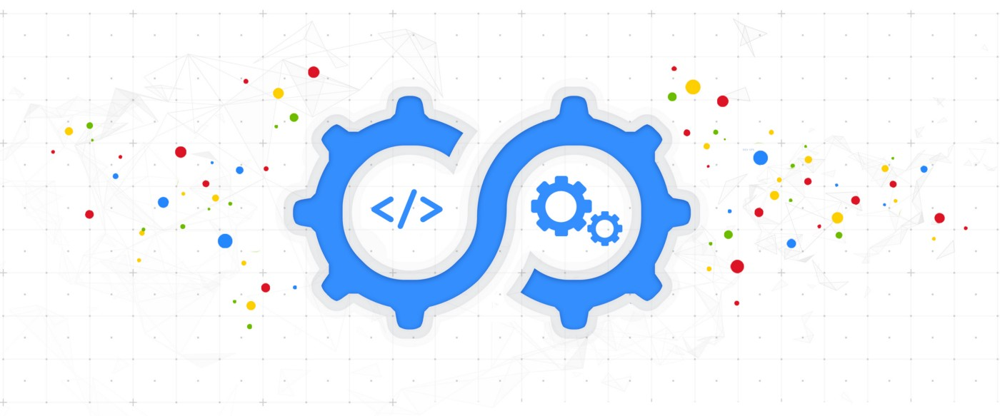

# Welcome 

# Overview
- [Introduction](./overview.md)
- [Contributors](./contributors.md)

# Let's get started
- [OPERATING SYSTEM](./os/os.md)
    - [Kernel](./os/kernel/kernel.md)
    - [System Calls](./os/syscalls/syscalls.md)
    - [Program vs Process](./os/program_process/programprocess.md)
    - [Threads](./os/threads/threads.md)
- [Linux](./linux/linux.md)
    - [Booting Process](./linux/booting/booting.md)
    - [Networking](./linux/networking/networking.md)
        - [OSI Model](./linux/networking/osi/osi.md)
        - [DNS](./linux/networking/dns/dns.md)
        - [UDP](./linux/networking/udp/udp.md)
        - [TCP](./linux/networking/tcp/tcp.md)
        - [HTTP(TLS,SSL,HTTPS)](./linux/networking/http/http.md)
        - [IPv4 vs IPv6](./linux/networking/ip/ip.md)
        - [ICMP](./linux/networking/icmp/icmp.md)
        - [Troubleshooting](./linux/networking/troubleshooting/troubleshooting.md)
            - [ping](./linux/networking/troubleshooting/ping/ping.md)
            - [traceroute](./linux/networking/troubleshooting/traceroute/traceroute.md)

# Intermediate
- [SRE](./sre/sre.md)
    - [Tools](./sre/tools/tools.md)
        - [Virtualization](./sre/tools/virtualization/virtualization.md)