# Booting Process of Linux System

### ***GRUB***
- loads configurations form /boot/grub2/grub.cfg
- displays a menu to select kernel to boot
- loads vmlinuz
    - extract initramfs

### ***KERNEL***
- The kernel checks for the presence of the initramfs and, if found, mounts it as / and runs /init
- Kernal intitalize all hardware that are found as driver in initramfs

### ***initramfs***
- only purpose of an initramfs is to mount the root filesystem

### ***/sbin/init***
- PID = 1
- systemd PID = 0 (this is the first process)
- The init program is typically a shell script

## ***Run Level***
- preset single digit integer for defining the operating state of OS
- */etc/rc.d* will be have a set of files/dir named rc.0, rc.1, rc.2, rc.3, rc.4, rc.5 and rc.6
- Single user mode - 1
- Multi-user mode - 5
### Various other modes (7)
0.  System halt i.e the system can be safely powered off with no activity.
1.  Single user mode.
2.  Multiple user mode with no NFS(network file system).
3.  Multiple user mode under the command line interface and not under the graphical user interface.
4.  User-definable.
5.  Multiple user mode under GUI (graphical user interface) and this is the standard runlevel for most of the LINUX based systems.
6.  Reboot which is used to restart the system.
