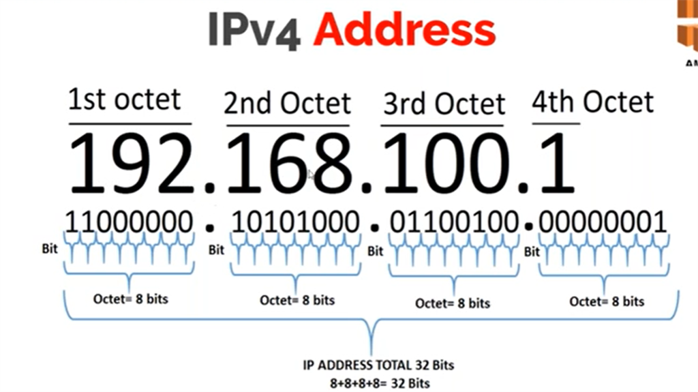

# IPv4 vs IPv6
- IPv4 - Internet Protocol version 4
- IPv6 - Internet Protocol version 6

## What is IPv4?
- Establishes the rules for computer networks functioning on the principle of packet exchange
- It can uniquely identify devices connected to the network through an addressing system
- The IPv4 uses a 32-bit address scheme allowing to store 2^32 addresses (4.19 billion addresses)
- The increasing end-users connected to the Internet leads to the exhaustion of IPv4 addresses
- That’s also why the new Internet addressing system, IPv6, is being deployed to fulfill the need for more Internet addresses
- Address representation of IPv4 is in decimal

## What is IPv6?
- The use of IPv6 not only solves the problem of limited network addresses resources but also resolves the barriers for multiple access devices to connect to the Internet
- Address Representation of IPv6 is in hexadecimal

When it comes to IPv4 vs IPv6 speed, **IPv6 is thought to be faster because of the lack of network-address translation (NAT)**. That's because: Carriers can't provide unique IPv4 addresses to all subscribers (because there simply are not enough left to go around)

>IPv4 may still exist for a long time, but eventually, IPv6 addresses will become the norm.