# OPERATING SYSTEM

An Operating System is a program that manages a computer's hardware. It also provides a basis for application programs and acts as an intermediary between computer user and computer hardware.

### Abstract view of the components of a computer system

**Parts of OS**
- [Kernel](./kernel/kernel.md)
- Device drivers
- User Interface
- System Libraries
- System utilities - disk formaters, data recovery etc..

**Functions**

- Kernel functions + 
    - provides CLI/GUI
    - provides sys utilities
    - provides sys libraries