# Program vs Process

**PROGRAM:**
- An executable file that is stored on a hard disk or a secondary memory.
- Passive entity
- Memory: texts

**PROCESS:**
- The file or program under execution.
- Active entity
- Memory: stack + data + heap + text 


# PROCESS STATE DIAGRAM


## Each state means?

### ***NEW***
    - BATCH OS - Job arived in the job queue
    - Time sharing OS - process is being created
### ***READY***
    - Process waiting is ready queue for being assigned to a CPU/Processor
### ***RUNNING***
    - pgm is being executed on the cPU
### ***WAITING***
    - Process is waiting for some event to occur(I/O)
### ***TERMINATED***
    - Process has finished its execution


# INIT Process
- First process thst is started during the booting 
- Process ID PID = 1
- This process keeps running forever until shut down
- All other process are direct or indirect children of INIT

# Process creation using fork()

> fork() creates a new child process that is a copy of the parent process. 

When the parent process closes or crashes for some reason, it also kills the child process.

## What happens when fork() is called?

### ***Execution***
    - Both process starts executing from the next line after fork()

### ***Memory***
    - stack, heap, text etc are duplicated for teh child process

## What will fork () return? / How to differentiate parent process & child process?

- Returns the PID of the child process to the parent process
- Upon successful completion, fork() returns 0 to the child process
- -1 is returned to the parent process, no child process is created, and errno is set to indicate the error

## Sample

``` 
fork ();   // Line 1
fork ();   // Line 2
fork ();   // Line 3
```
```
       P        //parent process
       |
       L1       // There will be 1 child process 
    /     \     // created by line 1.
  L2      L2    // There will be 2 child processes
 /  \    /  \   //  created by line 2
L3  L3  L3  L3  // There will be 4 child processes 
                // created by line 3
```

So there are total eight processes (new child processes and one original process).

- The main process: P0
- Processes created by the 1st fork: P1
- Processes created by the 2nd fork: P2, P3
- Processes created by the 3rd fork: P4, P5, P6, P7

> for *n* fork() calls, there will be *2^n* processes

## What happens to child process when parent is killed?
If the parent is killed, children become children of the init process (that has the process id 1 and is launched as the first user process by the kernel). The init process checks periodically for new children, and waits for them (thus freeing resources that are allocated by their return value).


## Zombie Process

A process which has finished the execution but still has entry in the process table to report to its parent process.



If the parent process is not running anymore, then the presence of a zombie process indicates an operating system bug.

## Can we kill zombie process?
We can't kill a zombie process because it's *already dead*. It won't respond to any signals because it's been removed from memory.

## Orphan Process
A process whose *parent process no more exists* i.e. either finished or terminated without waiting for its child process to terminate.
Orphan process gets reparented and new parent in most case is INIT process