# System Calls
User applications use sys calls to talk to the hardware. Codes to sys calls are implemented in the kernel, that's the reason why everything must be passed to the kernel.

**Category of System Calls in Linux OS**

- Process Management - fork(), exec(), wait(), exit()
- Memory Management - brk(), sbrk(), mmap()
- File system MAnagement - write(), read(), open(), close()
- Inter process communication(IPC) - pipe(), socket(), connect(), send(), recv()